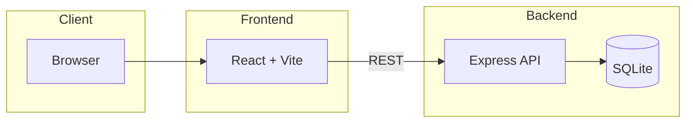

# :clipboard: Project Tracker

Task list: React + Vite frontend, Express backend, SQLite. Monorepo (root package.json runs both).

```
backend/     Express API, SQLite in backend/data/
frontend/    React app
```

---

## :triangular_ruler: Architecture



- **Frontend**: React + Vite, talks to backend on port 3000
- **Backend**: Express, SQLite (better-sqlite3), REST API

---

## :gear: Setup

```bash
npm run install:all
```

---

## :rocket: Run

```bash
npm run dev
```

(Or `npm run dev:backend` / `npm run dev:frontend` in two terminals.)

---

## :hammer: Build & test

- `npm run build` – frontend prod build
- `npm run lint` – ESLint + type-check (frontend and backend)
- `npm test` – backend then frontend tests. Backend: start server first, then `npm run test:backend`. Frontend: `npm run test:frontend`.

---

## :floppy_disk: Backend

SQLite in `backend/data/tasks.db` (override with `SQLITE_DB_PATH`).

| Doc                                          | Description                       |
| -------------------------------------------- | --------------------------------- |
| [docs/API.md](docs/API.md)                   | Endpoints and validation          |
| [docs/DATABASE.md](docs/DATABASE.md)         | Edit DB from CLI or VS Code       |
| [docs/NEW-ENDPOINT.md](docs/NEW-ENDPOINT.md) | How to add a new endpoint         |
| `http://localhost:3000/api-docs`             | Swagger UI (when backend running) |

---

## :sparkles: App

CRUD tasks, get by ID, optional "Created by", search/filter by status and text, sort by due date/title/status. Stats, toasts, dark mode (localStorage), title length 200, due date labels (today, overdue, etc.). Shortcuts: `n` new, `Esc` cancel, `/` search.

---

## :chart_with_upwards_trend: Future Enhancements

- **Hosting & scaling**: AWS Lambda (serverless), S3 + CloudFront for frontend; Redis for caching
- **Code as infrastructure**: AWS CDK
- **Logging & monitoring**: Winston, Grafana
- **Auditing**: `updated_by`, `deleted_at`
- **Security**: Rate limiting; auth for protected endpoints (API keys, token)
